> 注意：因为不同显卡对虚拟机中的环境和飞机渲染有较大影响，故默认情况下，下面的虚拟机没有开启3D硬件加速，建议大家在不熟悉硬件配置的情况下也先不要开启显卡等选项（在启动虚拟机按键下面的设置中）

1. 在学习通的课程资料中下载
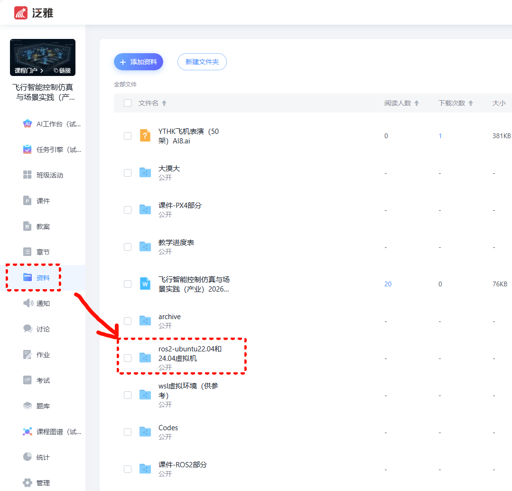

2. 下载虚拟机软件和虚拟机镜像
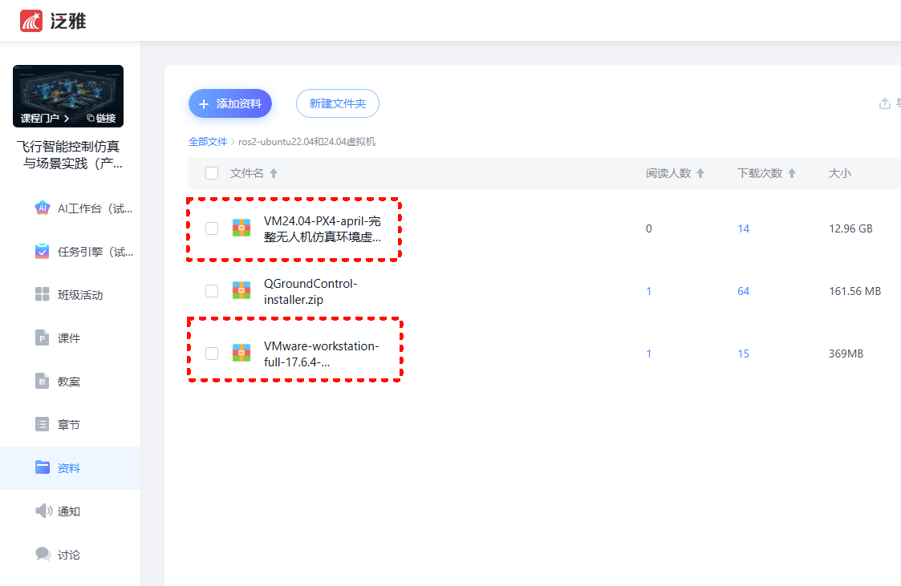

3. 下载完成解压后的内容有如下2部分：vmware workstation 的安装程序 + 虚拟机镜像的文件夹
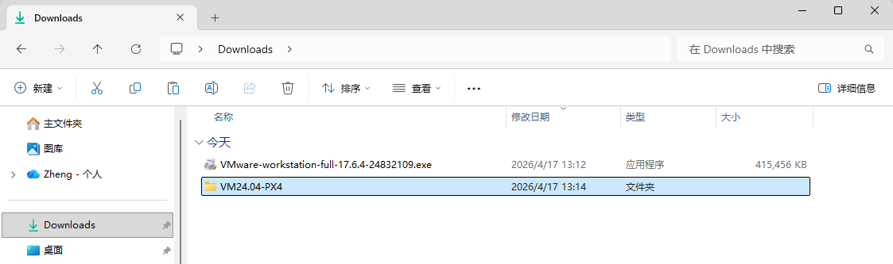

4. 开始安装 vmware workstation 虚拟机软件的最新版（如果以前安装过其他版本，需要彻底删除干净）
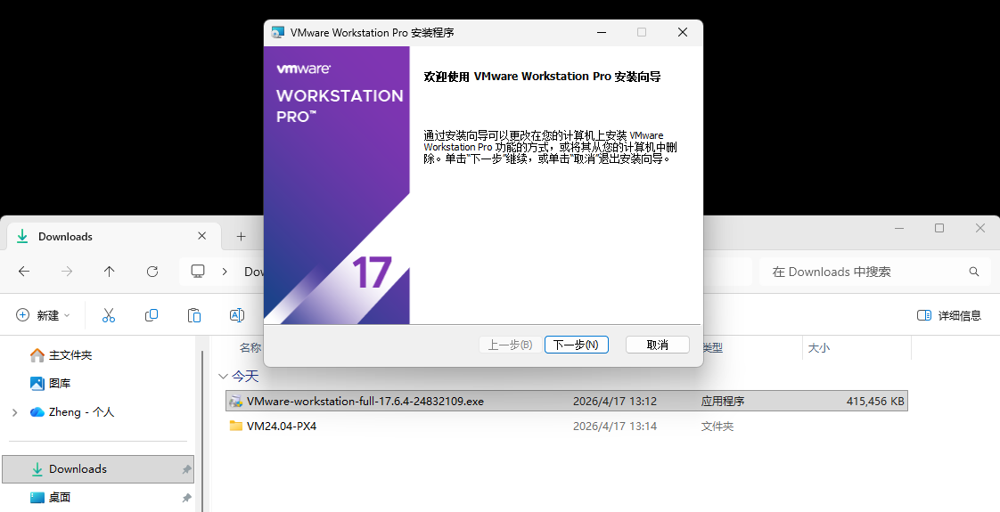

5. 打开虚拟机（不是新建）
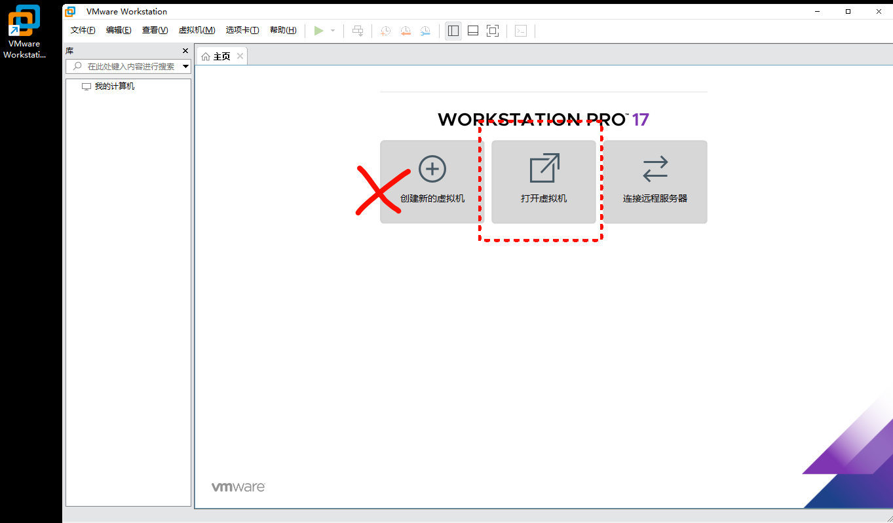

6. 在刚才下载的位置找到虚拟机镜像的文件夹
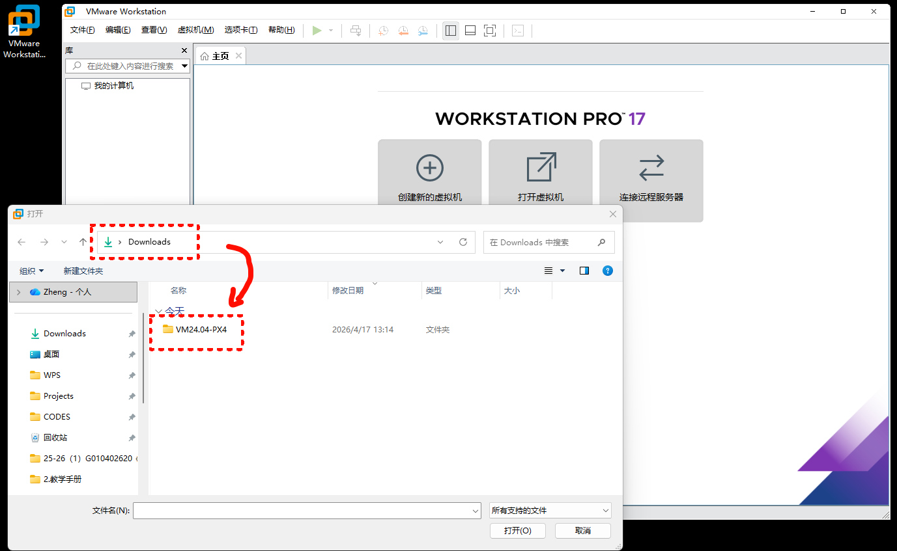

7. 进入文件夹导入 vmx 类型的文件
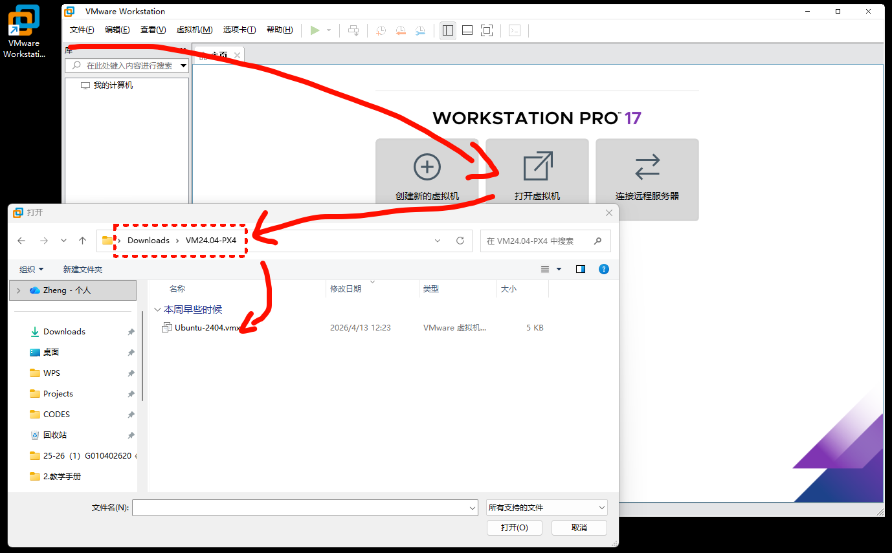

8. 导入成功后，运行虚拟机
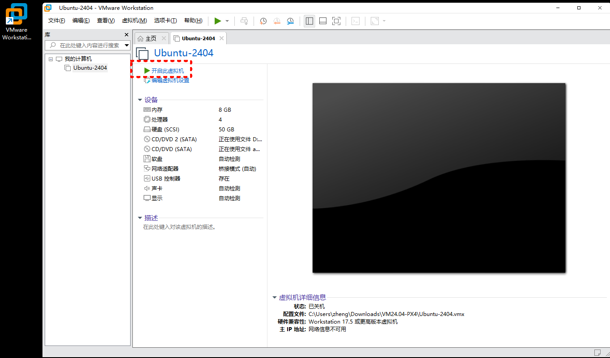

9. 第一次运行会有一个选项提示
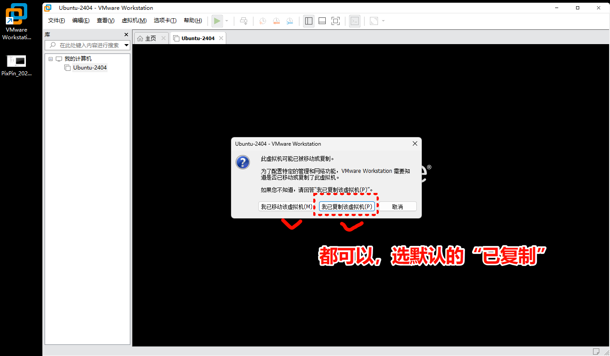

10. 进入 linux 之后，在左侧任务栏上打开两个‘终端’terminal 程序
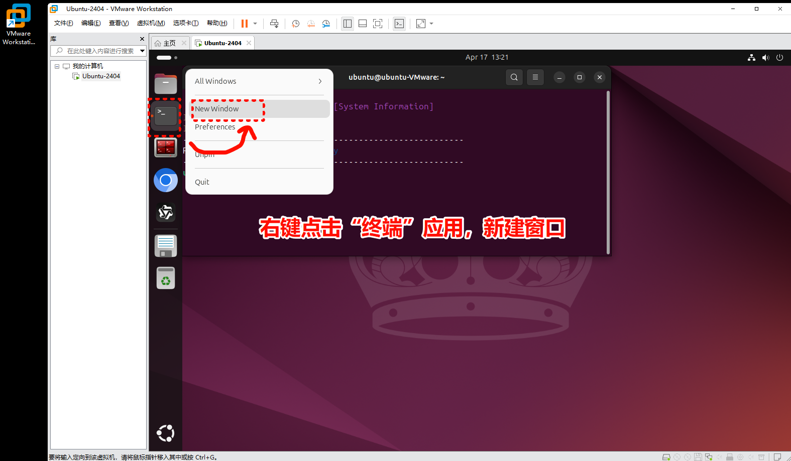

11. 按照作业和课件中指导的内容，运行模拟器和地面站程序
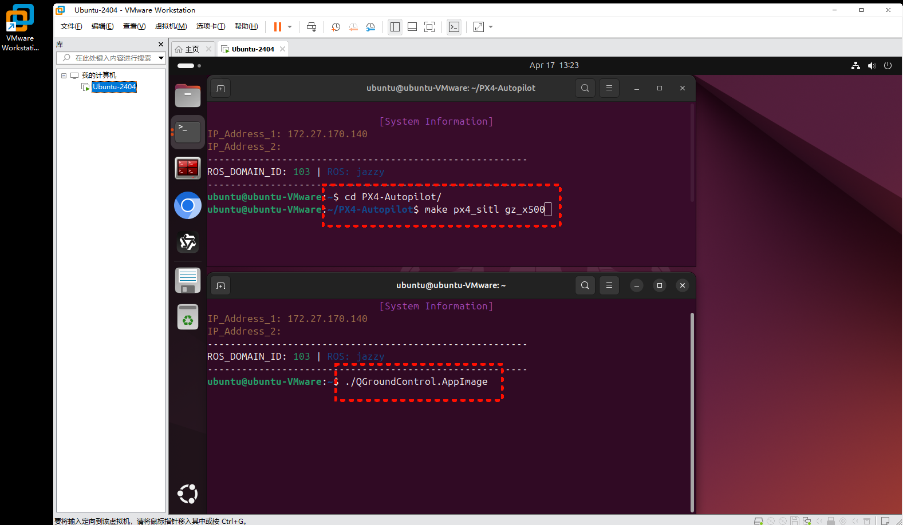

12. 得到和实验室机房一致的模拟和实验仿真环境
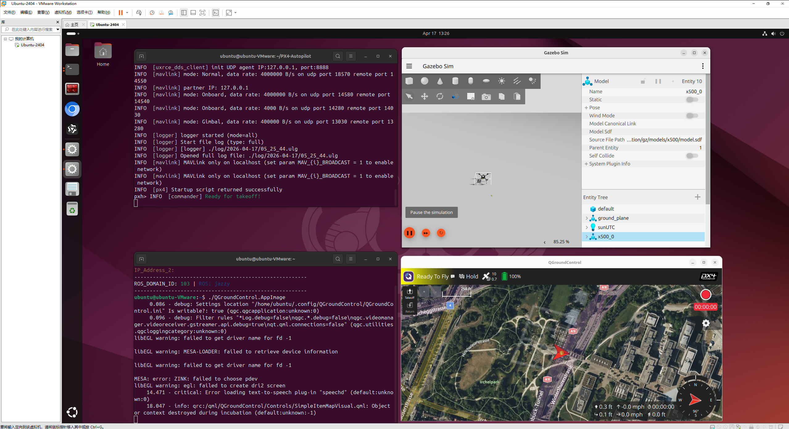

