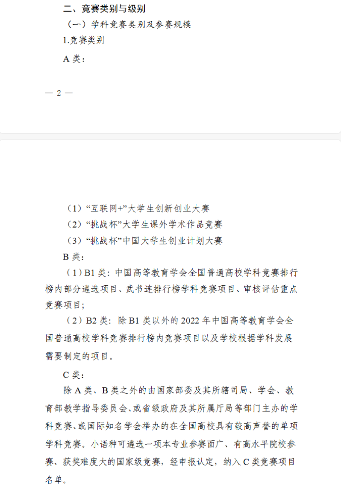
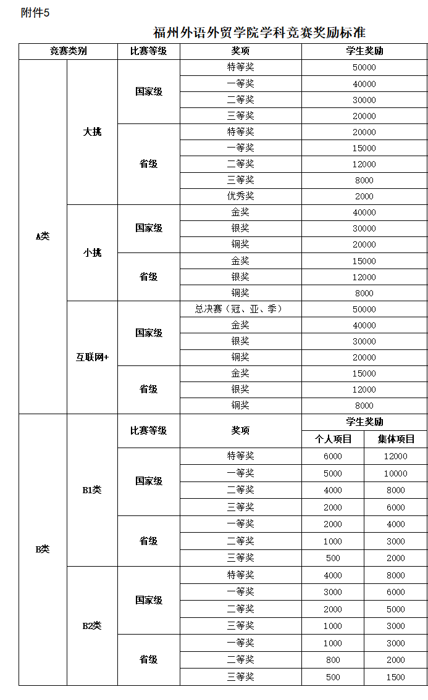

# 课程 Introduction

## 产业学院

- 企业项目驱动
- 创新型学科竞赛


| 产业学院 - 低空经济  | 学科竞赛 - 人工智能 |
| ---                | ---              |
| 物流吊运            | 等级高、赛事多；赛题灵活、创新性强  |
| 智能巡检            | 机器人（无人机）控制 |
| 无人机消杀          | 自主规划、避障等特殊场景和任务 |
| 集群表演等          | 集群协作 |

> 英特航空的真实业务场景

---

<!-- header: "ROS2+PX4 无人机仿真实践 - 学科竞赛" -->


<div align="center">
  
  
  

</div>


---
<!-- header: "ROS2+PX4 无人机仿真实践 - 课程内容" -->


> ROS2 基本都是通过代码或者脚本进行配置的，适合大模型 Vibe Coding

---

## 大模型时代

### 需要什么能力，稀缺性在哪里

- 编程不是没用了，而是下沉了。
- know what 和 know how 都变得不重要了，know why 变成了关键能力。
- 初级程序员几乎不需要了（这个很矛盾）。 


**解决问题的能力+意识**

**项目、实践、踩坑的经验是价值，而刷题不再是**

--- 
## 这门课要怎么上

用 **大模型** 解决 **实际问题**

_而不是教大家语法和编程_

<br />

> 怎么用、用哪些 **大模型**

---

## 怎么用、用哪些 **大模型**


- [Arena AI Leaderboard](https://arena.ai/leaderboard)
- [Artificial Analysis](https://artificialanalysis.ai/)

<br />

- **GLM-5**: 
- **Kimi-K2.5**:
- **Minimax-M2.5**:

- Qwen3.5
- Deepseek-v4?
- Doubao???

---

## 版本更迭的挑战

#### 参考书目

1. 刘相权、张万杰，《机器人操作系统(ROS2)入门与实践》，机械工业出版社，2024年8月，ISBN：9787111758433
2. 桑欣，《机器人操作系统(ROS2)入门与实践》，机械工业出版社，2024年7月，ISBN：9787111758068
3. 高中华、胡乔生、李文君，《无人机操控技术》，机械工业出版社，2024年1月，ISBN：9787111740476
4. 侯伟、靳紫轩，《ROS 2机器人操作系统与Gazebo机器人仿真》，清华大学出版社，2024年12月，ISBN：9787302702535

---

#### 在线资源

- ROS2官方文档：https://docs.ros.org/en/jazzy/
- PX4用户指南：https://docs.px4.io/main/en/
- Gazebo Harmonic文档：https://gazebosim.org/docs/harmonic/
- Nav2导航框架文档：https://docs.nav2.org/
- 亚博Jetson Nano/Orin系列教程：https://www.yahboom.com/study/ROSMASTER-M1
- 北航飞思实验室 Rflysim：https://rflysim.com/doc/
- 浙大FAST Lab ego-planner-swarm：https://github.com/ZJU-FAST-Lab/ego-planner-swarm
- 北大XTDrone2：https://github.com/andy-zhuo-02/XTDrone2
- 阿木实验室 Prometheus V3
- 鱼香ROS FishBot


---

# ROS2 简介


## 开始之前

- ROS2 的开发基本都是配置文件和代码，设置“小车”和“无人机”的模型都是用**代码+配置**声明的
- git 对于 vibe coding 的重要性

---

## ROS2 机器人操作系统

### 1. ROS2 概念

- **ROS** (Robot Operating System) 是用于机器人软件开发的**开源中间件**
- **ROS2** 是 ROS 的新一代版本，于2020年正式发布
- ROS2 并非 ROS 的小幅度更新，而是**完全重写**

---

### 2. ROS 发展历程

| 版本 | 发布时间 | 特性 |
| ------ | ---------- | ------ |
| ROS1 | 2010年 | 科研为主，实时性差 |
| ROS2 | 2020年 | 工业级，实时性强 |
| ROS2 Humble | 2022年 | 长期支持版本 LTS |

---

### 3. ROS2  vs  ROS1

#### ROS1 缺点

- 通信基于TCPROS/UDPROS，实时性差
- 无实时操作系统(RTOS)支持
- 核心API不稳定
- 几乎只支持Linux，集成开发工具不完善

#### ROS2 改进

- 基于DDS(数据分发服务)通信
- 支持RTOS (Real-Time OS)
- 核心API稳定
- 支持多平台 (Linux/Windows/macOS)
- 集成工具完善，安全性设计

---

### 4. ROS2 组成

#### 4.1 计算图

- **节点(Node)**: 独立运行的程序模块
- **话题(Topic)**: 异步通信机制
- **服务(Service)**: 同步通信机制
- **动作(Action)**: 可取消的同步机制
- **参数(Parameter)**: 节点配置参数

#### 4.2 生态系统

- **rcl**: ROS客户端库
- **rclcpp**: C++客户端库，**rclpy**: Python客户端库
- **rviz2**: 3D可视化工具
- **gazebo**: 仿真平台

---

# ROS2 安装 (Humble)

## 1. 系统要求

- **Ubuntu**: 22.04 (推荐)
- **内存**: 最小 2GB，建议 4GB+
- **磁盘空间**: 至少 50GB

## 2. 安装步骤

### 2.1 设置语言环境

```bash
locale  # 检查语言环境
sudo apt update && sudo apt install locales
sudo locale-gen en_US en_US.UTF-8
sudo update-locale LC_ALL=en_US.UTF-8 LANG=en_US.UTF-8
export LANG=en_US.UTF-8
```

---

### 2.2 添加ROS2源

```bash
# 安装依赖工具
sudo apt install software-properties-common
sudo add-apt-repository universe

# 添加ROS2 GPG密钥
sudo apt update && sudo apt install curl -y
sudo curl -sSL https://raw.githubusercontent.com/ros/rosdistro/master/ros.key -o /usr/share/keyrings/ros-archive-keyring.gpg

# 添加源
echo "deb [arch=$(dpkg --print-architecture) signed-by=/usr/share/keyrings/ros-archive-keyring.gpg] http://packages.ros.org/ros2/ubuntu $(lsb_release -cs) main" | sudo tee /etc/apt/sources.list.d/ros2.list > /dev/null
```

---

### 2.3 安装ROS2包

```bash
# 更新apt
sudo apt update

# 桌面版安装 (推荐)
sudo apt install ros-humble-desktop

# 基础版安装
sudo apt install ros-humble-ros-base

# 开发工具
sudo apt install ros-dev-tools
```

### 2.4 环境设置

```bash
# 自动source
echo "source /opt/ros/humble/setup.bash" >> ~/.bashrc
source ~/.bashrc
```

---

### 2.5 验证安装

```bash
# 检查ROS2环境变量
printenv | grep ROS

# 启动小海龟demo
ros2 run turtlesim turtle_simulator

# 启动键盘控制(新终端)
ros2 run turtlesim turtle_teleop_key
```

---

# ROS2 集成开发环境搭建

## 1. VSCode 安装与配置

### 1.1 安装VSCode

### 1.2 常用插件

| 插件 | 功能 |
|------|------|
| C/C++ | C/C++代码补全、调试 |
| Python | Python开发支持 |
| ROS | ROS功能支持 |
| Markdown All in One | Markdown编辑 |
| Marp | PPT预览 |

---

### 1.3 VSCode ROS配置

```json
{
    "ROS.Distro": "humble",
    "C_Cpp.default.configurationProvider": "ms-vscode.cpptools"
}
```

### 1.4 创建ROS2工作空间

```bash
# 创建工作空间
mkdir -p ~/ros2_ws/src
cd ~/ros2_ws
colcon build
source install/setup.bash
```

---

## 2. C++ 开发环境（简介）

所有开发的基础环境

- 操作系统: Ubuntu 22.04 LTS (Jammy Jellyfish)。
- 编译与构建工具:
build-essential: 包含GCC, G++, make等基础编译工具。
cmake: 跨平台的构建系统生成工具，ROS 2项目必备。
git: 版本控制工具，用于克隆代码仓库。
- 其他工具:
python3-colcon-common-extensions: Colcon构建工具的扩展，更便捷的命令。
python3-rosdep: ROS依赖管理工具。

---

## 3. Git配置

```bash
# 配置Git
git config --global user.name "Your Name"
git config --global user.email "your@email.com"

# SSH密钥
ssh-keygen -t ed25519 -C "your@email.com"
cat ~/.ssh/id_ed25519.pub  # 添加到GitHub
```
