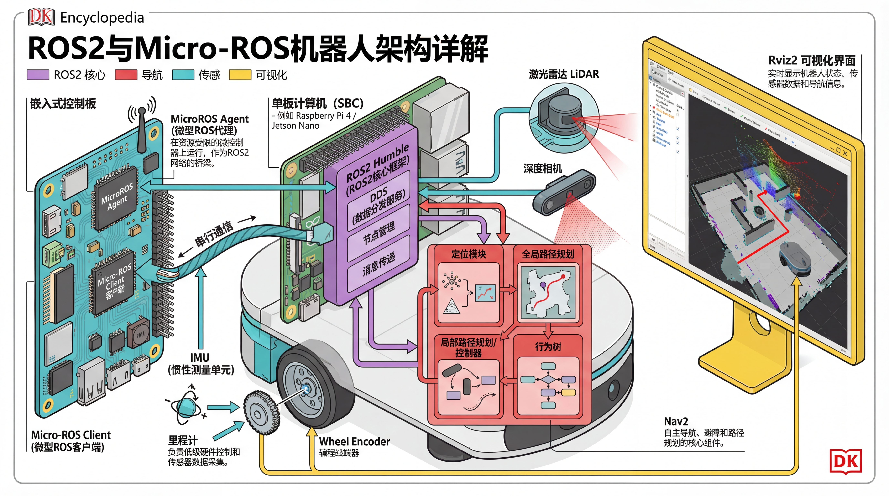
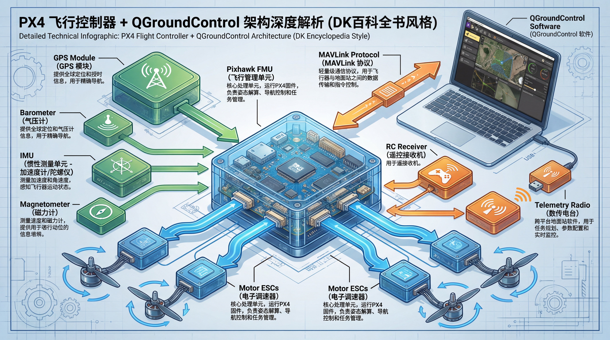
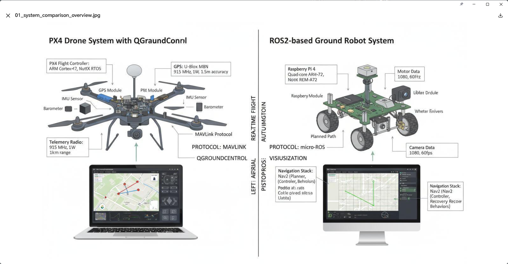
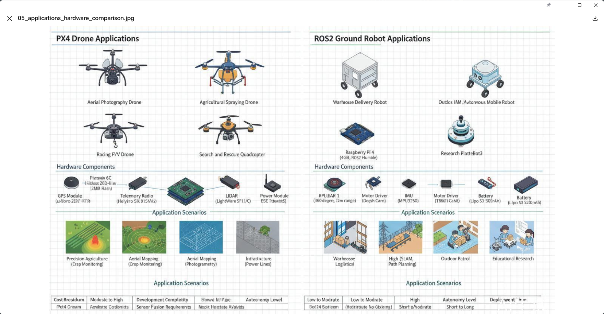
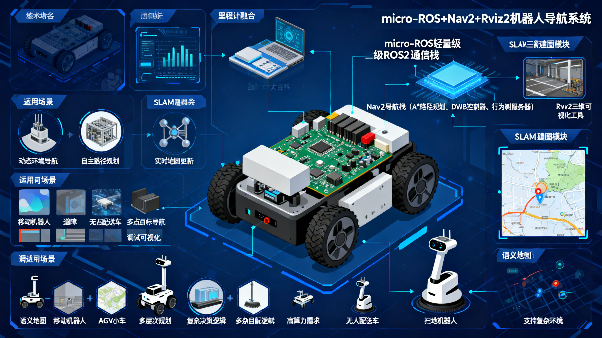
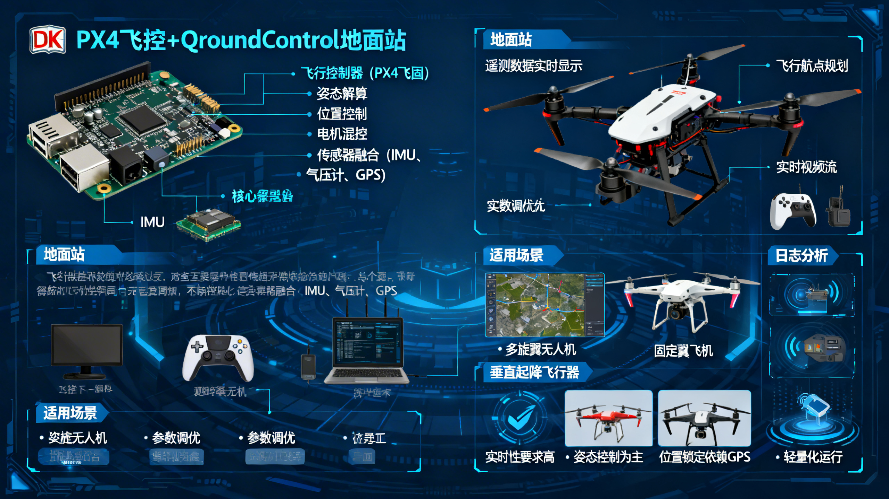
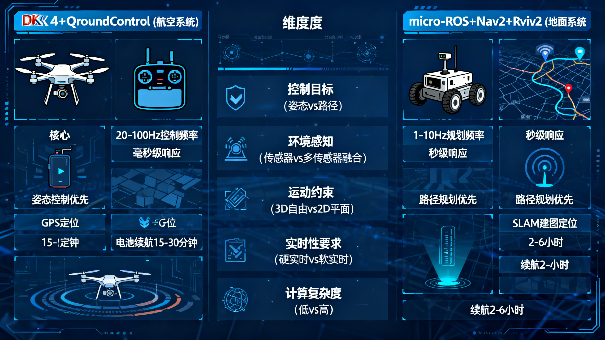
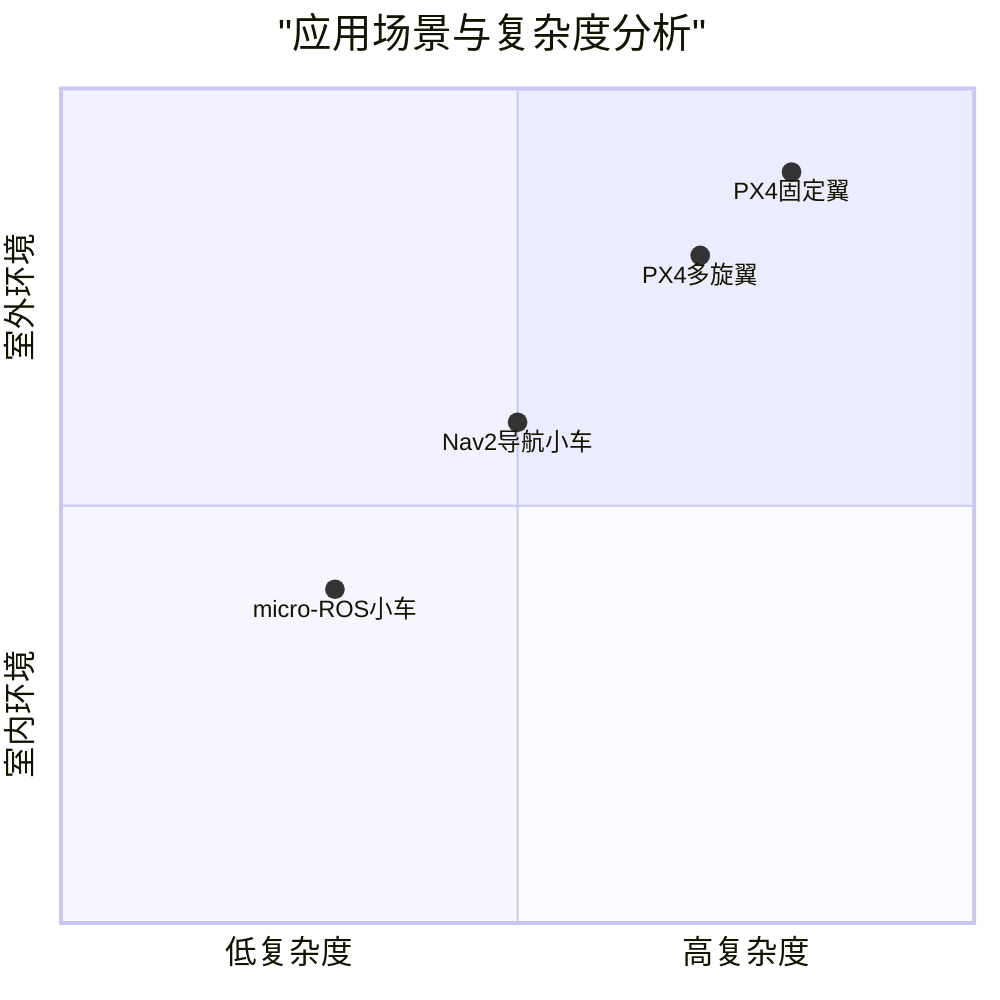

# Introduction

具体商业产品：[阿木实验室 - Prometheus 系列](https://docs.amovlab.com/prometheus-wiki/#/src/Prometheus-%E8%87%AA%E4%B8%BB%E6%97%A0%E4%BA%BA%E6%9C%BA%E5%BC%80%E6%BA%90%E9%A1%B9%E7%9B%AE/Prometheus%E9%85%8D%E5%A5%97%E7%A1%AC%E4%BB%B6?id=%e9%85%8d%e5%a5%97%e7%a1%ac%e4%bb%b6)

## 案例1：minimax





## 案例2： kimi




### 案例3：ArkClaw







---
# PX4 与 导航的关系

> monica

好问题，但需要纠正一下图中的表述——那个"3D导航原生支持"的说法**过于简化，容易误导**。让我客观拆解：

---

## PX4 的"3D导航"到底内置在哪里？

### 实际情况

PX4 本身**不是导航栈**，它是**飞行控制器固件**。它"原生支持3D"的含义是：

> **PX4 的控制器天然工作在 3D 空间（x/y/z + 姿态），接受三维位置/速度指令**

这与 Nav2 的"2D为主"形成对比——Nav2 的代价地图、路径规划默认是 2D 平面的。

---

## 具体技术分层

### ① PX4 内部：飞行模式 + 轨迹跟踪

| 组件 | 技术方案 | 说明 |
|------|---------|------|
| **位置控制器** | PID / MPC（模型预测控制） | 接受 3D 位置目标 `(x,y,z)` |
| **轨迹生成** | `FlightTaskAuto` | 平滑连接航点，生成 3D 轨迹 |
| **任务执行** | Navigator 模块 | 解析航点任务，逐点下发 3D 目标 |
| **EKF2** | 扩展卡尔曼滤波 | 融合 IMU+GPS 输出 3D 状态估计 |

这些都在 **PX4 固件内部**，运行于 Pixhawk 的 NuttX RTOS 上。

---

### ② 高层路径规划：依赖外部方案

PX4 **自身没有复杂路径规划**，3D 避障/规划需要外挂：

| 方案 | 技术 | 备注 |
|------|------|------|
| **QGC 航点任务** | 简单折线航点 | 手动设置高度，无动态避障 |
| **MAVROS + MoveIt** | ROS1 运动规划 | 学术场景常见 |
| **PX4 + ROS2 + Nav2** | DDS 桥接 | Nav2 实验性支持3D，非主流 |
| **Auterion / Skynav** | 商业方案 | 基于 PX4 的商业封装 |
| **offboard 模式** | 外部计算机发 `SET_POSITION_TARGET` | 最灵活，自己实现规划 |

---

### ③ 对比图中表述的准确修正

```
原图说法：
  PX4 → 3D导航 ✓（原生支持）
  Nav2 → 3D导航 △（2D为主）

更准确的说法：
  PX4 → 3D 控制执行层 ✓（天然三维）
         3D 路径规划层 △（需外部方案）
  Nav2 → 2D 导航成熟 ✓
         3D 导航（Nav2 Humble+）实验性支持
```

---

## 结论


- PX4 内置的是 **3D 飞行控制执行能力**（控制器 + EKF2 + 轨迹跟踪）
- **不包含**智能路径规划、动态避障等高层导航能力
- 真正的 3D 自主导航需要 **Offboard 模式 + 外部规划器**（如 ROS2 + OMPL/MoveIt2）


----
# PX4+QGroundControl vs micro-ROS+Nav2+Rviz2 系统架构深度对比

> mimo v2 pro

## 📈 **技术栈深度对比**

| **维度**    | **PX4 + QGroundControl** | **micro-ROS + Nav2 + Rviz2** |
| --------- | ------------------------ | ---------------------------- |
| **操作系统**  | NuttX RTOS (硬实时)         | FreeRTOS + Linux (软实时)       |
| **通信中间件** | MAVLink v2 (专有协议)        | ROS 2 DDS (标准化)              |
| **控制频率**  | 1kHz-8kHz (姿态控制)         | 100Hz-1kHz (运动控制)            |
| **建图定位**  | 地理围栏/航点导航                | SLAM/AMCL粒子滤波                |
| **路径规划**  | 航点到航点直线/曲线               | 全局+局部路径规划                    |
| **可视化**   | QGroundControl (2D地图)    | Rviz2 (3D可视化)                |
| **传感器支持** | 飞行传感器优化                  | 通用机器人传感器                     |
| **开发语言**  | C++ (主导)                 | C++/Python (混合)              |
| **社区生态**  | 无人机专用生态                  | 通用机器人生态                      |
| **学习曲线**  | 陡峭 (飞行专业知识)              | 中等 (ROS生态知识)                 |

## 🎯 **应用场景对比**



### **PX4 理想场景**：
1. **无人机航测**：高精度GNSS+RTK
2. **自主飞行任务**： waypoint导航
3. **编队飞行**：多机协同
4. **应急响应**：快速部署
5. **农业植保**：精准喷洒

### **micro-ROS+Nav2 理想场景**：
1. **室内服务机器人**：商场导购、医院配送
2. **仓储物流**：AGV/AMR
3. **教育科研**：机器人算法验证
4. **家庭服务**：扫地机器人、陪伴机器人
5. **工业巡检**：管道、设备巡检

## ⚙️ **配置与部署对比**

### **PX4 典型配置流程**：
```
1. 硬件组装 → 2. 固件烧录 → 3. QGC连接
→ 4. 传感器校准 → 5. 参数调优 → 6. 飞行测试
→ 7. 任务规划 → 8. 实际部署
```

### **micro-ROS+Nav2 典型配置流程**：
```
1. 硬件组装 → 2. micro-ROS固件烧录
→ 3. ROS2环境配置 → 4. 传感器驱动安装
→ 5. URDF模型创建 → 6. Nav2参数调优
→ 7. SLAM建图 → 8. 导航测试
```

## 🚀 **性能指标对比**

| **指标** | **PX4 系统** | **Nav2 系统** | **说明** |
|----------|-------------|--------------|----------|
| **控制延迟** | <5ms | 10-50ms | PX4硬实时优势 |
| **定位精度** | 厘米级(RTK) | 分米级(SLAM) | GNSS vs 视觉 |
| **地图更新** | 静态地图 | 动态更新 | Nav2支持实时建图 |
| **避障能力** | 基础避障 | 高级避障 | Nav2插件丰富 |
| **多机协同** | MAVLink原生 | ROS2 DDS | 两者都支持 |
| **功耗** | 较低(优化) | 较高(通用计算) | 专用 vs 通用 |

## 💡 **选择建议**

| **选择 PX4 如果**： | **选择 micro-ROS+Nav2 如果**： |
|-------------------|--------------------------------|
| 开发无人机应用 | 开发地面移动机器人 |
| 需要硬实时控制 | 需要丰富的ROS生态 |
| 熟悉航空电子 | 熟悉ROS/ROS2 |
| 需要成熟的飞行控制 | 需要高级导航功能 |
| 应用在室外开阔环境 | 应用在室内复杂环境 |

## 🔮 **未来发展趋势**

1. **PX4方向**：更紧密的ROS2集成，支持更多机型
2. **micro-ROS方向**：更轻量级，支持更多微控制器
3. **Nav2方向**：AI增强导航，更智能的行为树
4. **融合趋势**：PX4+ROS2混合系统，空地协同
