## 简介

飞控：PX4 -> 软件 + 硬件
QGC：开源地面站，可以部署在多种设备中

#### 对比图
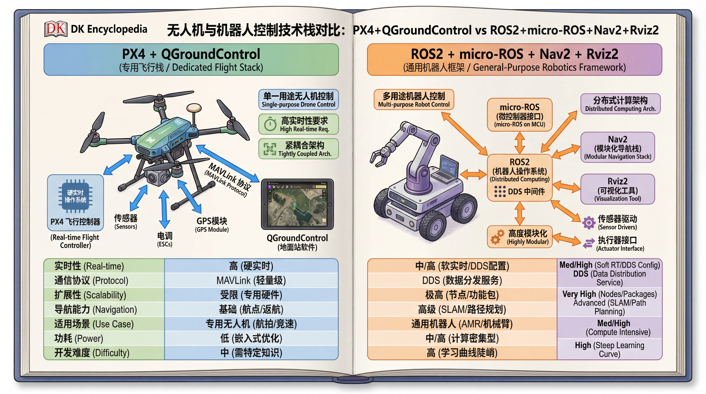
#### 架构
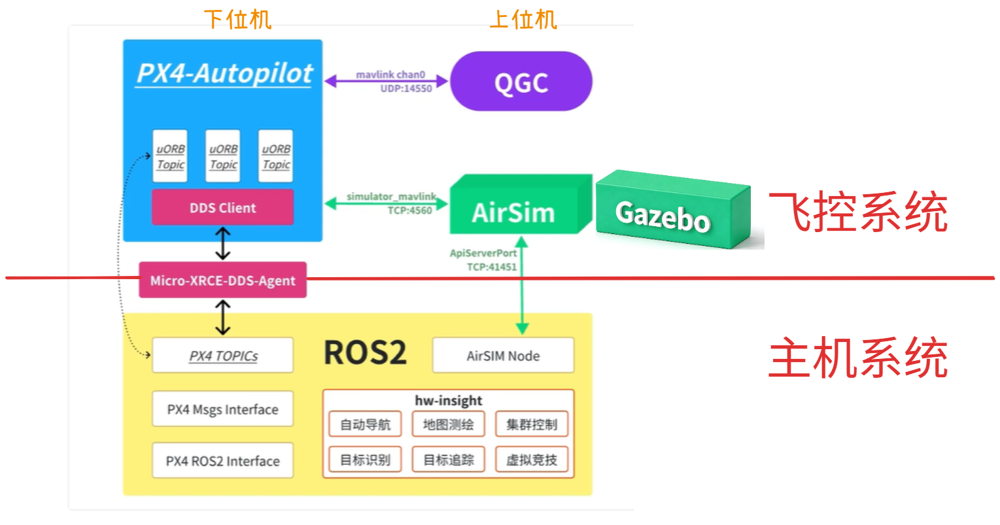
## 无人机 <---> 飞控(软+硬) <---> 电脑

mavlink

- 仿真链接
	- 遥控 - 端口直连（简单任务）
	- Control - ROS2 对接（自定义控制 + 二次开发 + 算法 + 多平台部署安装）
- 实机链接 [阿木450演示视频](https://www.bilibili.com/video/BV1Hq4y1o7Dt)

## 飞控系统

### [仿真环境] 加载不同的 world 
各种 world 和 model 的用法
`/home/ubuntu/PX4-Autopilot/Tools/simulation/gz`

在这里选择仿真软件或版本，Gazebo Harmonic（不是 Gazebo Classis）即 gz，然后可以查看到 `models` 和 `worlds` 目录

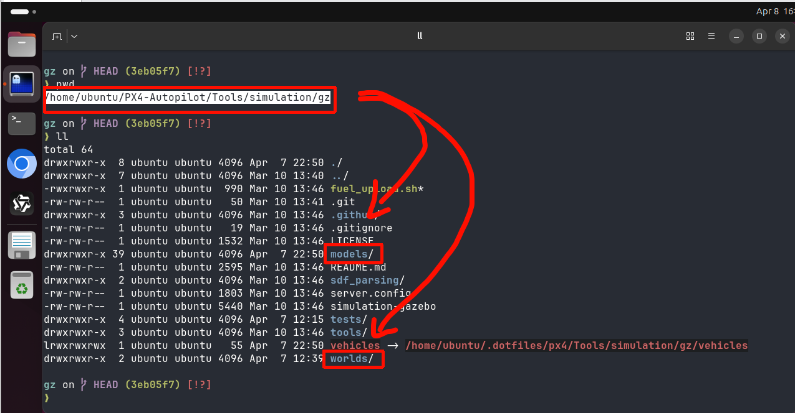

- WORLD 的选择
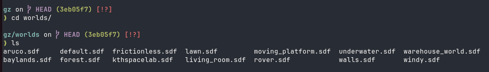

```bash
PX4_GZ_WORLD=walls make px4_sitl gz_x500
```

- 飞机模型的选择
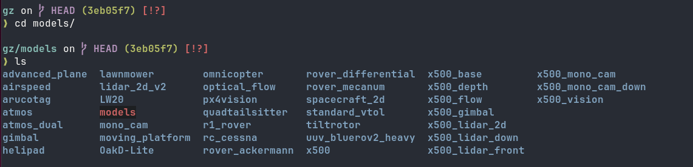

```bash
make px4_sitl gz_tiltrotor
```

```bash
make px4_sitl gz_x500_depth
```
### 摄像头 - Camera

**飞机模型 - sensor**

- x500_depth
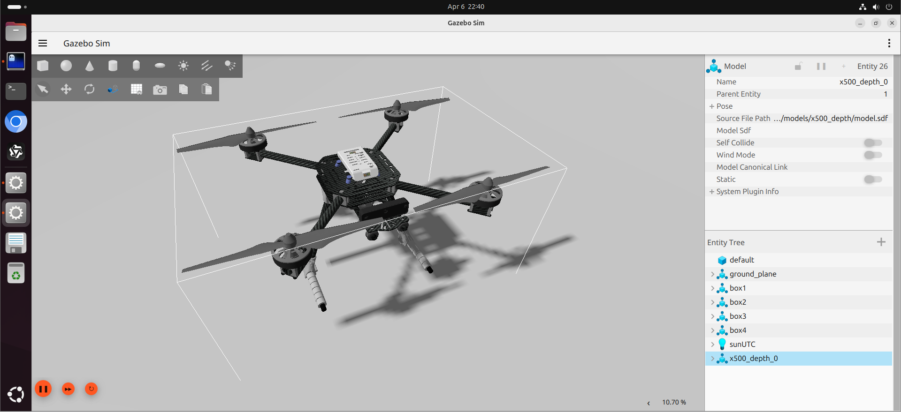

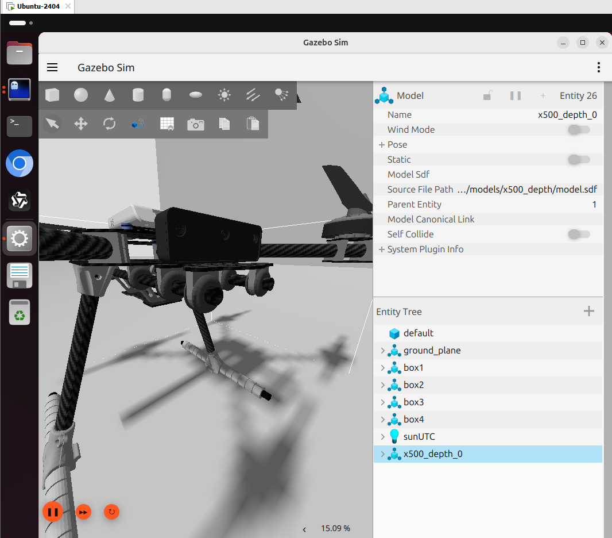

- x500
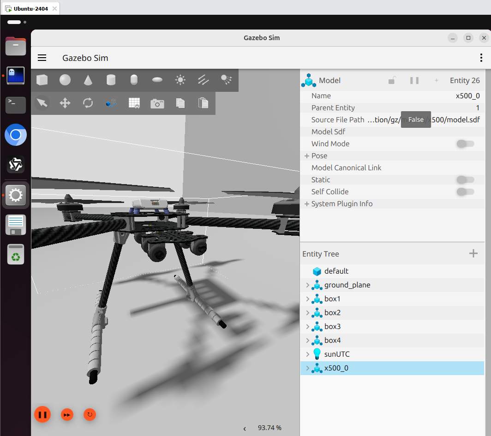

**设置截图**
增加 QGC 上的视频显示（会变卡）
 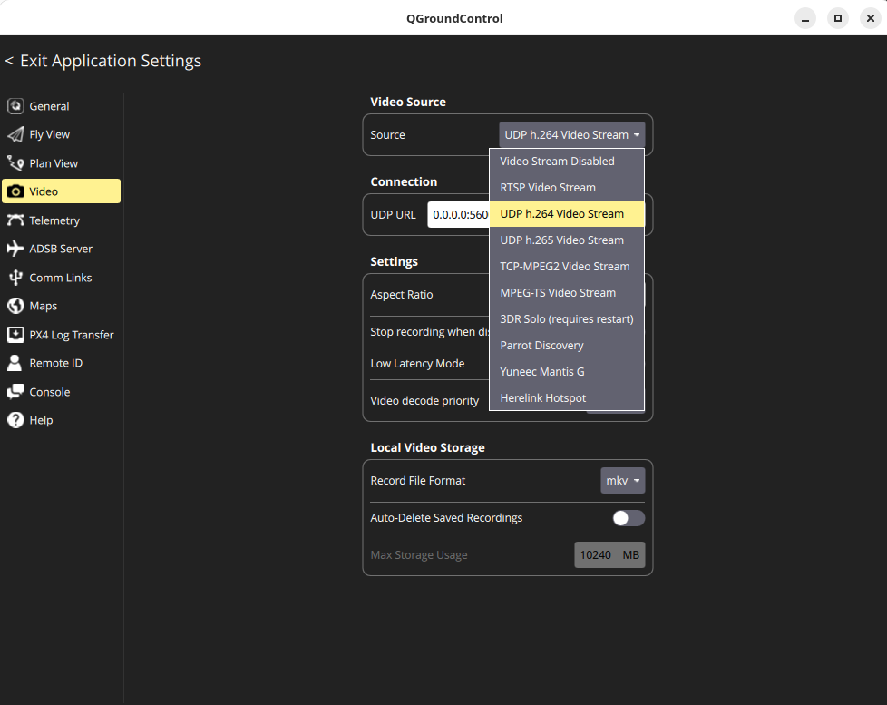

> 如果 QGC 中无法看到视频：有的版本需要手动设置摄像头数据从 gazebo 转为 QGC 的视频流。
> 在独立的 terminal中运行：
> gz topic -e -t /world/default/model/x500_0/link/camera_link/sensor/camera/image | gst-launch-1.0 fdsrc !   video/x-raw,format=RGB,width=640,height=480 !   videoconvert !   x264enc tune=zerolatency bitrate=800 speed-preset=ultrafast !   rtph264pay !   udpsink host=127.0.0.1 port=5600


### QGC 控制功能（非 QGC 主要功能，只是辅助实现）

当飞机飞的高度不够，或者想调整角度，可以用屏幕虚拟手柄进行微调。

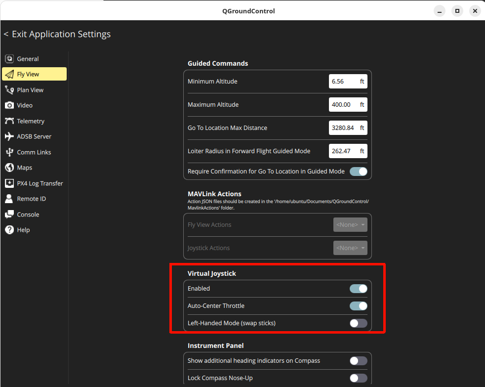


### 地面站 - 开源 + 全平台

#### Android 端 QGC
- 某品牌宣传

- 某品牌视频教程

- 某民间手搓自主导航：[https://www.bilibili.com/video/BV1UN4y157qR](https://www.bilibili.com/video/BV1UN4y157qR)

#### windows 端 QGC

> 学习通资料中，有最新版 QGC for windows。

1. QGC --> Application Settings --> Comm Links
	在 `Links` 部分添加 UDP 协议的链接，端口填写为默认的 14450，保存后，在 links 列表中选择‘连接‘。
2. PX4 Sitl --> `make px4_sitl gz_x500` --> 启动后，回车，进入 ”pxh>"的console，输入：
```
mavlink start -t <电脑的IP> -u 14550
```

>mavlink start -t 192.168.31.24 -u 14550

**设置截图**
- windows 端 GQC 的通信设置
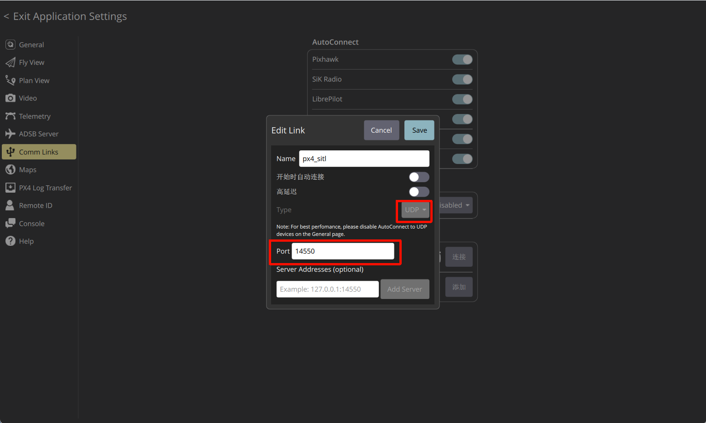


--------------------------------
> 实验一：重复以上步骤，掌握 QGC + PX4 的进阶用法
-----------------------------------------

### 地面站 - [仿真环境] 显示指定区域
> - LAT、LON、ALT
> - pilot

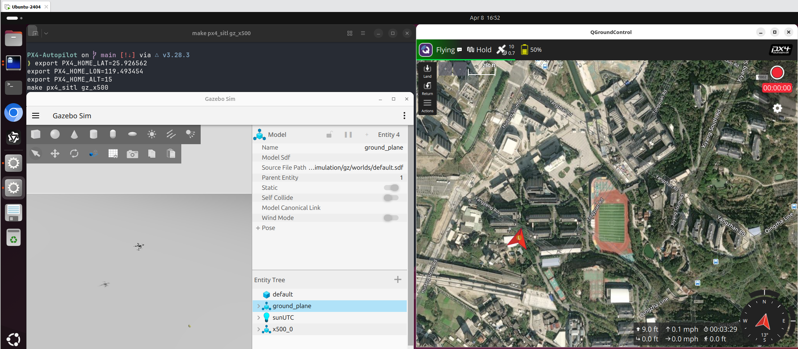

- PX4 Autopilot 
```bash
export PX4_HOME_LAT= 
export PX4_HOME_LON=
export PX4_HOME_ALT=
make px4_sitl gz_x500
```


### 多个飞机 Multi-drones

> QGC 的用途并不是用于无人机集群的控制的

- 3台无人机 - win11 + WSL + QClaw(简单实现)
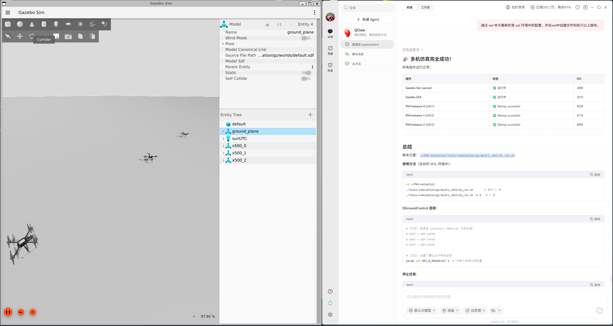

- 3台无人机 - takeoff 状态，逐个操作
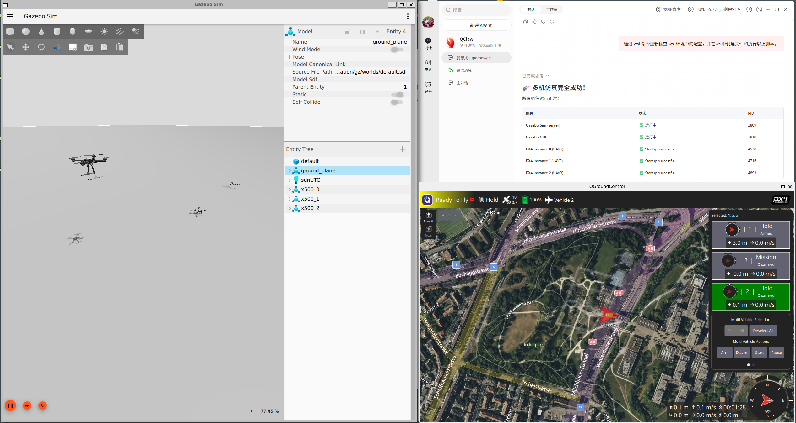

- 2 台无人机飞行计划 
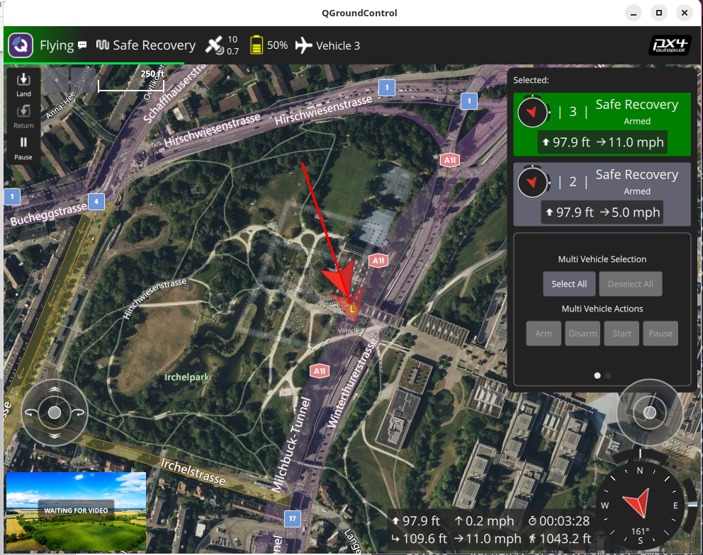

官方文档：[https://docs.px4.io/main/en/sim_gazebo_gz/multi_vehicle_simulation](https://docs.px4.io/main/en/sim_gazebo_gz/multi_vehicle_simulation)

- 步骤 1 - Terminal 1: 加载 drone 1 (包含：启动 Gazebo server):
```
PX4_SYS_AUTOSTART=4001 PX4_SIM_MODEL=gz_x500 ./build/px4_sitl_default/bin/px4 -i 1
```

- 步骤 2 - Terminal 2: 加载 drone 2 (包含：链接已启动的 Gazebo server):
```
PX4_GZ_STANDALONE=1 PX4_SYS_AUTOSTART=4001 PX4_GZ_MODEL_POSE="0,1" PX4_SIM_MODEL=gz_x500 ./build/px4_sitl_default/bin/px4 -i 2
```

### 说明:
- -i 1 and -i 2 give each instance a unique ID for MAVLink sysid assignment
- PX4_GZ_STANDALONE=1 on the second instance connects to the existing Gazebo server instead of starting a new one
- PX4_GZ_MODEL_POSE="0,1" offsets the second drone by 1 meter in Y so they don't spawn on top of each other


------------------
> 实验二：自己设计简单场地（px4 gz环境 + QGC 地图） + 多个无人机
---------------


## Control - 通过 ROS2

### 打通 topics
- Micro-XRCE-DDS Agent
```bash
MicroXRCEAgent udp4 -p 8888
```
- 查看 topic 列表
```bash
ros2 topic list
```
- 查看传感器数据（例如 轨迹点）
```bash
ros2 topic echo /fmu/in/trajectory_setpoint
```


------------------------------------
> 实验三：通过 ros2 中的代码方式（采用基于大模型的 coding 方式，或者自己找一些代码、脚本），模拟控制系统，使无人机可以完成特定轨迹的飞行（比如绕圈、8字）
------------------------
